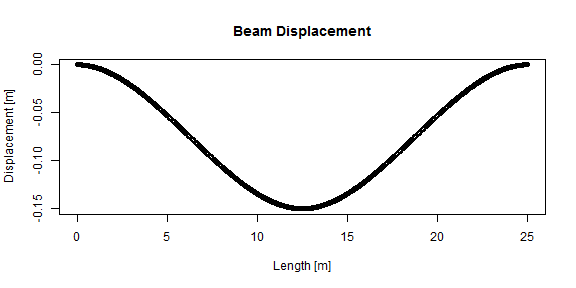

Beam displacement
========================================================
author: Riccardo Roganti
date:  03/06/2017
autosize: true

Final assignment for the course "Developing data products"

Project description
========================================================

The  goals of the final assignment are two:

- Build an interactive Shiny application
- Make a related presentation

The R environment provides handy tool that allow to create and deploy apps and presentations by using R code to which we may be more familiar.

The application
========================================================

The application plots the deformation and internal forces in a beam according to some input information:

- Property of the beam
- Type of constraint
- Position and value of load

Only two type of constraints are possible:

- Fixed End: both ends cannot move or rotate
- Simple supported: both ends cannot move but can rotate


Slide With Plot
========================================================


A function has been created to evaluate the displacement of the beam. It is possible to plot the displacement of the beam according to the input. In the figure the load is applied in the middle.


```r
plot(x, disp_calc(-10000, 45000, 12000, 25, 50, x, "fixed"), main="Beam Displacement", xlab="Length [m]", ylab="Displacement [m]")
```



The app allows to change the position of the load and to see the related displacement plot.

Links
========================================================

Link to the app: https://ricrog.shinyapps.io/beam_displacement/

Link to Github repository: https://github.com/ricrog/Developing-data-products-Beam-displacement
